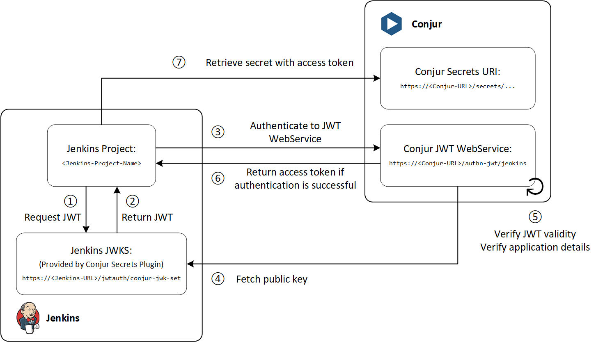

# Integrate Jenkins with Conjur Enterprise using the JWT authenticator
## Introduction
- This guide demonstrates the integration between Jenkins and Conjur using the JWT authenticator.
- The JWT authenticator relies on the trust between Conjur and Jenkins via the JSON Web Key Set (JWKS).
- Each project on Jenkins retrieving credentials will have its JWT signed and verified via the JWKS.
- This mitigates the "secret-zero" problem and enable each project on Jenkins to be uniquely identified.
- The demonstration will run 2 Jenkins project:
  - MySQL-Demo: Run a sql command to show databases using the credentials retrieved from Conjur
  - AWS-Access-Key-Demo: Run an AWS CLI command to list users using the credentials retrieved from Conjur

## How does Jenkins integration with Conjur using JWT work?


① The Jenkins project requests for a JWT from the Conjur Secrets Plugin

② Conjur Secrets Plugin returns a JWT for the Jenkins project with the relevant details; this JWT is signed with the private key of the JWKS

- Example JWT

```console
{
    "sub": "admin",
    "jenkins_full_name": "AWS-Access-Key-Demo",
    "iss": "https://jenkins.vx:8443",
    "aud": "vxlab",
    "jenkins_name": "AWS-Access-Key-Demo",
    "nbf": 1646394039,
    "identity": "vxlab-AWS-Access-Key-Demo",
    "name": "admin",
    "jenkins_task_noun": "Build",
    "exp": 1646394189,
    "iat": 1646394069,
    "jenkins_pronoun": "Pipeline",
    "jti": "88411dd3f2a4433694f6a707b3b99407",
    "jenkins_job_buildir": "/var/lib/jenkins/jobs/AWS-Access-Key-Demo/builds"
}

```

③ The Jenkins project sends an authentication request to Conjur using the JWT authenticator web service

- The Jenkins project finds the URI for JWT authenticator using `<Conjur-Appliance-URL>/authn-jwt/<service-id>`
- The URI configure in this demo is `https://conjur.vx/authn-jwt/jenkins`

④ Conjur fetches the public key from the JWKS of the Conjur Secrets Plugin

- When enabled, the Conjur Secrets Plugin creates a JWT Key Set endpoint at `<Jenkins-URL>/jwtauth/conjur-jwk-set
- This JWKS URI is set in the `jwks-uri` variable of the JWT authenticator in Conjur so that Conjur knows where to find the JWKS

⑤ Conjur verifies that the token is legit with the JWKS public key and authenticates application identity

- Conjur identifies the application identity via the `token-app-property` variable of the JWT authenticator
- The `token-app-property` variable is set in Conjur as the `identity` claim in this demo
- The `identity` claim in Jenkins is configured as `<aud>-<jenkins-name>` in this demo
- Conjur further verifies the applications details as configured in the `annotations` listed in the `host` (application identity) declaration
- In this demo, annotations `jenkins_full_name`, `jenkins_task_noun` and `jenkins_pronoun` are defined for the application identity - the JWT claims from Jenkins needs to tally with the declaration for application authentication to be successful

⑥ Conjur returns an access token to the Jenkins project if authentication is successful

⑦ The Jenkins project will then use the access token to retrieve the secrets

### Software Versions
- RHEL 8.5
- Jenkins 2.332.1
- Conjur Enterprise 12.5

### Servers

| Hostname  | Role |
| --- | --- |
| conjur.vx  | Conjur master  |
| jenkins.vx  | Jenkins node  |
| mysql.vx  | MySQL server  |

# 1. Setup MySQL database
- Setup MySQL database according to this guide: <https://joetanx.github.io/mysql-world_db>

# 2. Setup Conjur master
- Setup Conjur master according to this guide: <https://joetanx.github.io/conjur-master>

# 3. Setup Jenkins
## 3.1. Install Jenkins
```console
yum -y install java-11-openjdk-devel https://archives.jenkins-ci.org/redhat-stable/jenkins-2.332.1-1.1.noarch.rpm
```

## 3.2. Configure Jenkins to use HTTPS
- The Jenkins server certificate in this demo is signed by a personal CA, you should use your own certificate chain in your own environment
  - Refer to https://joetanx.github.io/self-signed-ca/ for a guide to generate your own certificates
```console
curl -L -o jenkins.vx.pfx https://github.com/joetanx/conjur-jenkins/raw/main/jenkins.vx.pfx
keytool -importkeystore -srckeystore jenkins.vx.pfx -srcstorepass cyberark -destkeystore /var/lib/jenkins/.keystore -deststoretype pkcs12 -deststorepass 'cyberark'
chown jenkins:jenkins /var/lib/jenkins/.keystore
rm -f jenkins.vx.pfx
```
- Edit Jenkins configuration file to use HTTPS
- ☝️ **Note**: Jenkins changed the SSL configuration from `/etc/sysconfig/jenkins` to `/usr/lib/systemd/system/jenkins.service` beginning with version 2.332.1 (Ref: <https://www.jenkins.io/doc/book/system-administration/systemd-services/>)
```console
sed -i 's/JENKINS_PORT=8080/JENKINS_PORT=-1/' /usr/lib/systemd/system/jenkins.service
sed -i '/JENKINS_HTTPS_LISTEN_ADDRESS/a Environment=\"JENKINS_HTTPS_LISTEN_ADDRESS=\"' /usr/lib/systemd/system/jenkins.service
sed -i '/JENKINS_HTTPS_PORT/a Environment=\"JENKINS_HTTPS_PORT=8443\"' /usr/lib/systemd/system/jenkins.service
sed -i '/JENKINS_HTTPS_KEYSTORE=/a Environment=\"JENKINS_HTTPS_KEYSTORE=\/var\/lib\/jenkins\/.keystore\"' /usr/lib/systemd/system/jenkins.service
sed -i '/JENKINS_HTTPS_KEYSTORE_PASSWORD/a Environment=\"JENKINS_HTTPS_KEYSTORE_PASSWORD=cyberark\"' /usr/lib/systemd/system/jenkins.service
```

### 3.4. Initialize Jenkins
- Allow Jenkins on firewall and start Jenkins
```console
firewall-cmd --add-port 8443/tcp --permanent && firewall-cmd --reload
systemctl enable --now jenkins
```
- Retrieve Jenkins initial admin password
```console
cat /var/lib/jenkins/secrets/initialAdminPassword
```
- Browse to the Jenkins URL `https://jenkins.vx:8443`
  - `Unlock Jenkins`: Enter the initial admin password
  - `Customize Jenkins`: Select `Install suggested plugins` and wait for the plugins to install (this will take a while...)
  - `Create First Admin User`: Create your user, or just skip to continue using admin
  - `Instance Configuration page`: Configure `Jenkins URL` according to your environment
    - ☝️ Note that you need to configure the `Jenkins URL` for the JWT integration to work

### 3.5. Prepare MySQL and AWS CLI client tools
- MySQL and AWS CLI client tools are needed in the Jenkins project execution later
- Setup MySQL client
```console
yum -y mysql
```
- Setup AWS CLI
```console
yum -y install unzip
curl https://awscli.amazonaws.com/awscli-exe-linux-x86_64.zip -o awscliv2.zip
unzip awscliv2.zip
./aws/install
```
- Clean-up
```console
rm -rf aws*
```

# 4. Conjur policies for Jenkins JWT
## 4.1. Details of Conjur policies used in this demo
- Ref: <https://docs.cyberark.com/Product-Doc/OnlineHelp/AAM-DAP/Latest/en/Content/Operations/Services/cjr-authn-jwt.htm>
- `authn-jwt.yaml` - Configures the JWT authenticator
  - defines the authenticator webservice at `authn-jwt/jenkins`
    - the format of the authenticator webservice is `authn-jwt/<service-id>`, the `<service-id>` used in this demo is `jenkins`, this will be entered into the Conjur Secrets Plugin configuration for `Auth WebService ID` below.
  - mandatory authentication variables:
    - `provider-uri` - OIDC Provider URI. For applications that uses JWT providers that supports ODIC. Not used in this demo.
    - `jwks-uri` - JSON Web Key Set (JWKS) URI. For Jenkins this is `https://<Jenkins-URL>/jwtauth/conjur-jwk-set`.
    - `ca-cert` - The CA certificate that signed the Jenkins server certificate. **Implemented only beginning from Conjur version 12.5.**
  - optional authentication variables:
    - `token-app-property` - The JWT claim to be used to identify the application. This demo uses the `identity` claim from Jenkins, which is configured in the Conjur Secrets Plugin under Jenkins to use `aud` concatenated with `jenkins_name` as identity. This variable is always used together with `identity-path`. 
    - `identity-path` - The Conjur policy path where the app ID (`host`) is defined in Conjur policy. The app IDs in `authn-jwt-hosts.yaml` are created under `jwt-apps/jenkins`, so the `identity-path` is `jwt-apps/jenkins`.
    - `issuer` - URI of the JWT issuer. This is your Jenkins URL. This is included in `iss` claim in the JWT token claims.
    - `enforced-claims` - List of claims that are enforced (i.e. must be present in the JWT token claims). Not used in this demo.
    - `claim-aliases` - Map claims to aliases. Not used in this demo.
    - `audience` - JWT audience configured in the Conjur Secrets Plugin under Jenkins. This is configured as `vxlab` in this demo.
  - defines `consumers` group - applications that are authorized to authenticate using this JWT authenticator are added to this group
  - defines `operators` group - users who are authorized to check the status of this JWT authenticator are added to this group
- `authn-jwt-hosts.yaml`
  - `jwt-apps/jenkins` - policy name, this is also the `identity-path` of the app IDs
  - applications `vxlab-AWS-Access-Key-Demo` and `vxlab-MySQL-Demo` are configured
    - the `id` of the `host` corresponds to the `token-app-property`
    - annotations of the `host` are optional and corresponds to claims in the JWT token claims - the more annotations/claims configured, the more precise and secure the application authentication
  - the host layer is granted as a member of the `consumers` group defined in `authn-jwt.yaml` to authorize them to authenticate to the JWT authenticator
  - `vxlab-AWS-Access-Key-Demo` and `vxlab-MySQL-Demo` are granted access to secrets in `aws_api` and `world_db` by granting them as members of the respective `consumers` group defined in `app-vars.yaml`
- ☝️ **Note**: `authn-jwt-hosts.yaml` builds on top of `app-vars.yaml` in <https://joetanx.github.io/conjur-master>. Loading `authn-jwt-hosts.yaml` without having `app-vars.yaml` loaded previously will not work.

## 4.2. Load the Conjur policies and prepare Conjur for Jenkins JWT
- Login to Conjur
```console
conjur init -u https://conjur.vx
conjur login -i admin -p CyberArk123!
```
- Download and load the Conjur policies
```console
curl -L -o authn-jwt.yaml https://github.com/joetanx/conjur-jenkins/raw/main/authn-jwt.yaml
curl -L -o authn-jwt-hosts.yaml https://github.com/joetanx/conjur-jenkins/raw/main/authn-jwt-hosts.yaml
conjur policy load -b root -f authn-jwt.yaml
conjur policy load -b root -f authn-jwt-hosts.yaml
```
- Enable the JWT Authenticator
```console
podman exec conjur sed -i -e '$aCONJUR_AUTHENTICATORS="authn,authn-jwt/jenkins"' /opt/conjur/etc/conjur.conf
podman exec conjur sv restart conjur
```
- Inject the CA certificate into a environment variable to be set into Conjur variable
- The Jenkins server certificate in this demo is signed by a personal CA (`central.pem`), you should use your own certificate chain in your own environment
- ☝️ **Note**: The `authn-jwt/<service-id>/ca-cert` variable is implemented begining from Conjur version 12.5. If you are using an older version of Conjur, the CA certificates needs to be trusted by the Conjur container. Read the `Archived - Trusting CA certificate in Conjur container` section at the end of this page.
```console
CA_CERT="$(curl -L https://github.com/joetanx/conjur-jenkins/raw/main/central.pem)"
```
- Populate the variables
- Assumes that the secret variables in `world_db` and `aws_api` are already populated in step 2 (Setup Conjur master)
```console
conjur variable set -i conjur/authn-jwt/jenkins/jwks-uri -v https://jenkins.vx:8443/jwtauth/conjur-jwk-set
conjur variable set -i conjur/authn-jwt/jenkins/ca-cert -v "$CA_CERT"
conjur variable set -i conjur/authn-jwt/jenkins/token-app-property -v identity
conjur variable set -i conjur/authn-jwt/jenkins/identity-path -v jwt-apps/jenkins
conjur variable set -i conjur/authn-jwt/jenkins/issuer -v https://jenkins.vx:8443
conjur variable set -i conjur/authn-jwt/jenkins/audience -v vxlab
```
- Clean-up
```console
rm -rf *.yaml
```

# 5. Configure Jenkins
## 5.1 Configure Conjur Secrets plugin
- Select `Manage Jenkins` → `Manage Plugins` → `Available`
- Search for `conjur`

- Check the plugin and select `Install without restart`

- Select `Manage Jenkins` → `Configure System`, scroll to `Conjur Appliance` and configure the following:
  - Account: `cyberark`
  - Appliance URL: `https://conjur.vx`
  - Enable JWT Key Set endpoint?: `✓`
  - Auth WebService ID: `jenkins`
  - JWT Audience: `vxlab`
  - Enable Context Aware Credential Stores?: `✓`
  - Identity Format Fields: `aud,jenkins_name`
- Save


## 5.2 Configure MySQL-Demo project
- Select `New Item` → Enter `MySQL-Demo` as name → Select `Pipeline`

- Scroll to `Conjur Appliance` → Click `Refresh Credential Store`

- For the `Pipeline script`, we will be using a simple `SHOW DATABASES` command to show that jenkins is able to login to the MySQL database with secrets fetched from conjur
- The secrets retrieval is done using `withCredentials` pipeline step (you can use the `Pipeline Syntax` function in Jenkins to help generate the syntax)
```console
pipeline {
    agent any
    stages {
        stage('getDatabases') {
            steps {
                withCredentials([conjurSecretCredential(credentialsId: 'world_db-username', variable: 'MYSQLUSER'), conjurSecretCredential(credentialsId: 'world_db-password', variable: 'MYSQLPASSWORD')]) {
                    sh '/usr/bin/mysql --host=mysql.vx --user=$MYSQLUSER --password=$MYSQLPASSWORD -e "SHOW DATABASES;"'
                }
            }
        }
    }
}
```

- Save and exit the project → Select the project again → Select `Credentials`
- The credentials that the project is authorized to access were populated automatically from the `Refresh Credential Store` action earlier

- Select `Build Now` → Wait for build → Verify `Console Output`


## 5.3 Configure AWS-Access-Key-Demo project
- Select `New Item` → Enter `AWS-Access-Key-Demo` as name → Select `Pipeline`

- Scroll to `Conjur Appliance` → Click `Refresh Credential Store`

- For the `Pipeline script`, we will be using a simple `aws iam list-users` command to show that jenkins is able to use AWS CLI with secrets fetched from conjur
- The secrets retrieval is done using `withCredentials` pipeline step (you can use the `Pipeline Syntax` function in Jenkins to help generate the syntax)
```console
pipeline {
    agent any
    environment {
        AWS_DEFAULT_REGION = 'ap-southeast-1'
    }
    stages {
        stage('awsListUsers') {
            steps {
                withCredentials([conjurSecretCredential(credentialsId: 'aws_api-awsakid', variable: 'AWS_ACCESS_KEY_ID'), conjurSecretCredential(credentialsId: 'aws_api-awssak', variable: 'AWS_SECRET_ACCESS_KEY')]) {
                    sh '/usr/local/bin/aws iam list-users'
                }
            }
        }
    }
}
```

- Save and exit the project → Select the project again → Select `Credentials`
- The credentials that the project is authorized to access were populated automatically from the `Refresh Credential Store` action earlier

- Select `Build Now` → Wait for build → Verify `Console Output`


# Archived - Trusting CA certificate in Conjur container
- For Conjur versions before 12.5, the `authn-jwt/<service-id>/ca-cert` variable was not yet implemented.
- If you are using a self-signed or custom certificate chain in your jenkins like I did in this demo, you will encounter the following error in Conjur, because the Jenkins certificate chain is not trusted by Conjur applicance.
```console
USERNAME_MISSING failed to authenticate with authenticator authn-jwt service cyberark:webservice:conjur/authn-jwt/jenkins:
**CONJ00087E** Failed to fetch JWKS from 'https://jenkins.vx:8443/jwtauth/conjur-jwk-set'.
Reason: '#<OpenSSL::SSL::SSLError: SSL_connect returned=1 errno=0 state=error: certificate verify failed (self signed certificate in certificate chain)>'
```
- Import your Jenkins certificate or the root CA certificate to Conjur appliance
- **Note**: The hash of my CA certificate is **a3280000**, hence I need to create a link **a3280000.0** to my CA certificate. You will need to get the hash of your own CA certificate from the openssl command, and link the certificate to `/etc/ssl/certs/<your-ca-hash>.0`
- This procedure is documented in: <https://cyberark-customers.force.com/s/article/Conjur-CONJ0087E-Failed-to-fetch-JWKS-from-GitLab-certificate-verify-failed>
```console
curl -L -o central.pem https://github.com/joetanx/conjur-jenkins/raw/main/central.pem
podman cp central.pem conjur:/etc/ssl/certs/central.pem
podman exec conjur openssl x509 -noout -hash -in /etc/ssl/certs/central.pem
podman exec conjur ln -s /etc/ssl/certs/central.pem /etc/ssl/certs/a3280000.0
```
