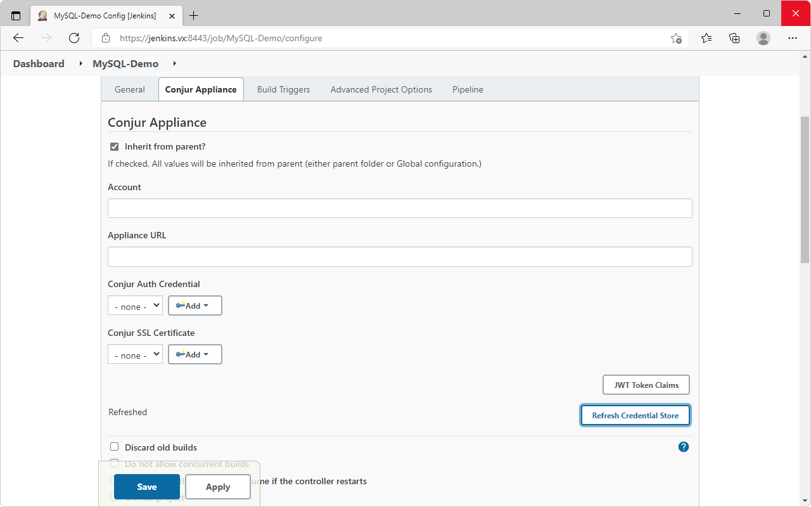
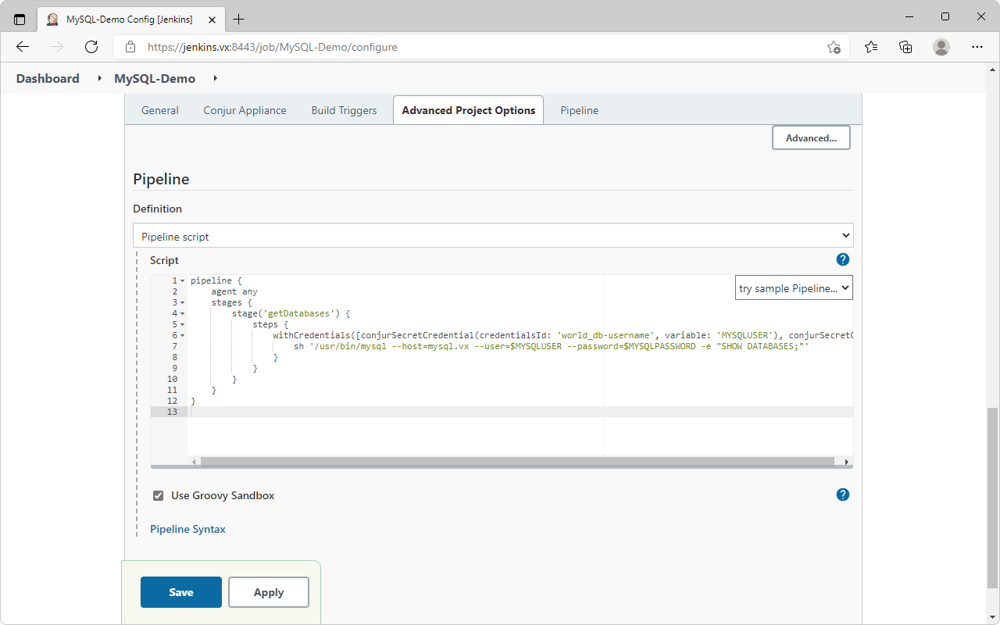
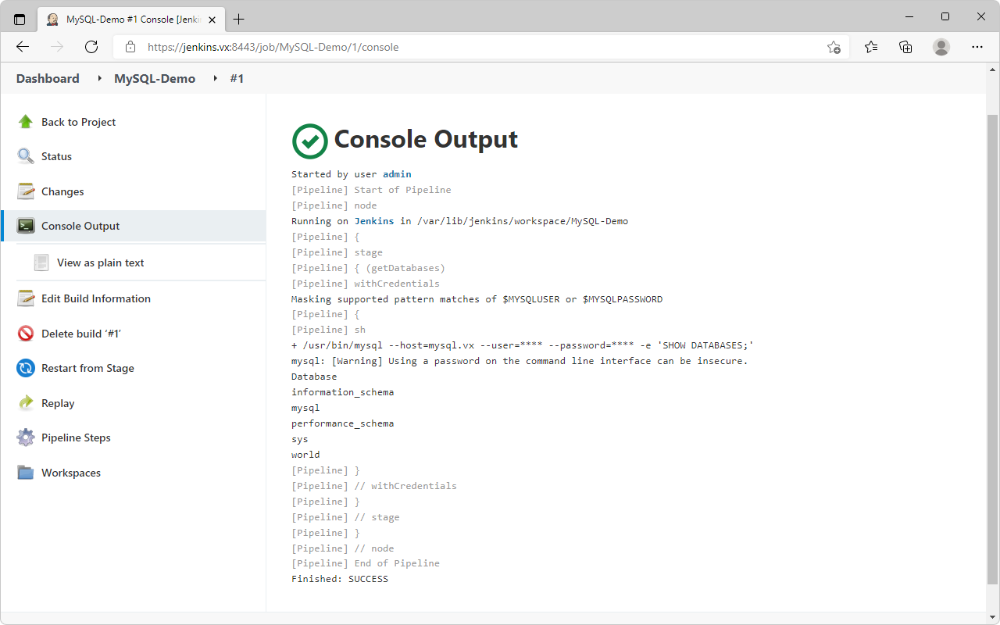
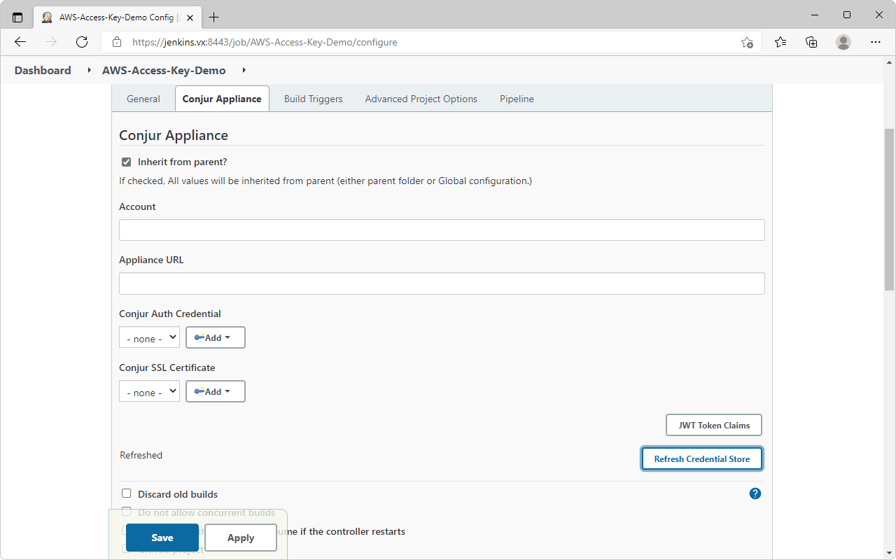
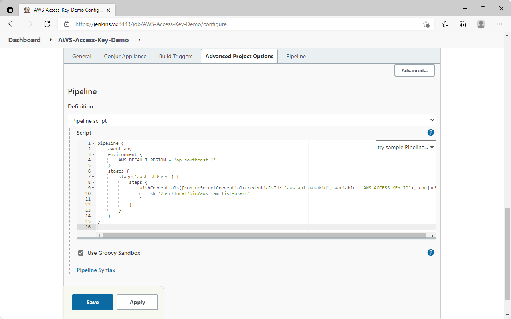

# Introduction
- This guide demonstrates the integration between Jenkins and Conjur using the JWT authenticator.
- The JWT authenticator relies on the trust between Conjur and Jenkins via the JSON Web Key Set (JWKS).
- Each project on Jenkins retrieving credentials will have its JWT signed and verified via the JWKS.
- This mitigates the "secret-zero" problem and enable each project on Jenkins to be uniquely identified.
- The demonstration will run 2 Jenkins project:
  - MySQL-Demo: Run a sql command to show databases using the credentials retrieved from Conjur
  - AWS-Access-Key-Demo: Run an AWS CLI command to list users using the credentials retrieved from Conjur
### Software Versions
- RHEL 8.5
- Jenkins 2.319
- Conjur 12.4
### Servers
| Hostname  | Role |
| --- | --- |
| conjur.vx  | Conjur master  |
| jenkins.vx  | Jenkins node  |
| mysql.vx  | MySQL server  |

# 1. Setup MySQL database
- Setup MySQL database according to this guide: https://github.com/joetanx/mysql-world_db
# 2. Setup Conjur master
- Setup Conjur master according to this guide: https://github.com/joetanx/conjur-master
# 3. Setup Jenkins
- Install dependencies, import rpm key, install Jenkins
```console
yum -y install java-11-openjdk-devel
yum -y install https://download-ib01.fedoraproject.org/pub/epel/8/Everything/x86_64/Packages/d/daemonize-1.7.8-1.el8.x86_64.rpm
rpm --import https://pkg.jenkins.io/redhat/jenkins.io.key
yum -y install https://archives.jenkins-ci.org/redhat-stable/jenkins-2.319.2-1.1.noarch.rpm
```
- Download and import SSL certificate for Jenkins
- You should be using your own certificate in your own lab
```console
curl -L -o jenkins.vx.pfx https://github.com/joetanx/conjur-jenkins/raw/main/jenkins.vx.pfx
keytool -importkeystore -srckeystore jenkins.vx.pfx -destkeystore /usr/lib/jenkins/.keystore -deststoretype pkcs12
```
- Clean-up
```console
rm -f jenkins.vx.pfx
```
- Edit Jenkins configuration file to use HTTPS
```console
sed -i 's/JENKINS_PORT=\"8080\"/JENKINS_PORT=\"-1\"/' /etc/sysconfig/jenkins
sed -i 's/JENKINS_HTTPS_PORT=\"\"/JENKINS_HTTPS_PORT=\"8443\"/' /etc/sysconfig/jenkins
sed -i 's/JENKINS_HTTPS_KEYSTORE=\"\"/JENKINS_HTTPS_KEYSTORE=\"\/usr\/lib\/jenkins\/.keystore\"/' /etc/sysconfig/jenkins
sed -i 's/JENKINS_HTTPS_KEYSTORE_PASSWORD=\"\"/JENKINS_HTTPS_KEYSTORE_PASSWORD=\"cyberark\"/' /etc/sysconfig/jenkins
sed -i 's/JENKINS_HTTPS_LISTEN_ADDRESS=\"\"/JENKINS_HTTPS_LISTEN_ADDRESS=\"0.0.0.0\"/' /etc/sysconfig/jenkins
```
- Reload services, enable Jenkins to start on boot, start Jenkins service, allow Jenkins on firewall
```console
systemctl daemon-reload
systemctl enable jenkins
systemctl start jenkins
systemctl status jenkins
firewall-cmd --add-port 8443/tcp --permanent && firewall-cmd --reload
```
- Retrieve Jenkins initial admin password
```console
cat /var/log/jenkins/jenkins.log
```
or
```console
cat /var/lib/jenkins/secrets/initialAdminPassword
```
# 4. Conjur policies for Jenkins JWT
## Details of Conjur policies used in this demo
- Ref: https://docs.cyberark.com/Product-Doc/OnlineHelp/AAM-DAP/Latest/en/Content/Operations/Services/cjr-authn-jwt.htm
- `authn-jwt.yaml` - Configures the JWT authenticator
  - defines the authenticator webservice at `authn-jwt/jenkins`
  - mandatory authentication variables:
    - `provider-uri` - OIDC Provider URI. For applications that uses JWT providers that supports ODIC. Not used in this demo.
    - `jwks-uri` - JSON Web Key Set (JWKS) URI
  - optional authentication variables:
    - `token-app-property` - The JWT claim to be used to identify the application. This demo uses the `identity` claim from Jenkins, which is configured in the Conjur Secrets Plugin under Jenkins to use `jenkins_name` as identity. This variable is always used together with `identity-path`. 
    - `identity-path` - The Conjur policy path where the app ID (`host`) is defined in Conjur policy. The app IDs in `authn-jwt-hosts.yaml` are created under `jwt-apps/jenkins`, so the `identity-path` is `jwt-apps/jenkins`.
    - `issuer` - URI of the JWT issuer. For Jenkins this is `https://<Jenkins-URL>/jwtauth/conjur-jwk-set`. This is included in `iss` claim in the JWT token claims.
    - `enforced-claims` - List of claims that are enforced (i.e. must be present in the JWT token claims). Not used in this demo.
    - `claim-aliases` - Map claims to aliases. Not used in this demo.
    - `audience` - JWT audience configured in the Conjur Secrets Plugin under Jenkins. This is configured as the host name of my Jenkins host `jenkins.vx` in this demo.
  - defines `consumers` group - applications that are authorized to authenticate using this JWT authenticator are added to this group
  - defines `operators` group - users who are authorized to check the status of this JWT authenticator are added to this group
- `authn-jwt-hosts.yaml`
  - `jwt-apps/jenkins` - policy name, this is also the `identity-path` of the app IDs
  - applications `AWS-Access-Key-Demo` and `MySQL-Demo` are configured
    - the `id` of the `host` corresponds to the `token-app-property`
    - annotations of the `host` are optional and corresponds to claims in the JWT token claims - the more annotations/claims configured, the more precise and secure the application authentication
  - the host layer is granted as a member of the `consumers` group defined in `authn-jwt.yaml` to authorize them to authenticate to the JWT authenticator
  - `MySQL-Demo` and `AWS-Access-Key-Demo` are granted access to secrets in `world_db` and `aws_api` by granting them as members of the respective `consumers` group defined in `app-vars.yaml`
> `authn-jwt-hosts.yaml` builds on top of `app-vars.yaml` in https://github.com/joetanx/conjur-master. Loading `authn-jwt-hosts.yaml` without having `app-vars.yaml` loaded previously will not work.
## Load the Conjur policies and prepare Conjur for Jenkins JWT
- Download the Conjur policies
```console
curl -L -o authn-jwt.yaml https://github.com/joetanx/conjur-jenkins/raw/main/authn-jwt.yaml
curl -L -o authn-jwt-hosts.yaml https://github.com/joetanx/conjur-jenkins/raw/main/authn-jwt-hosts.yaml
```
- Login to Conjur
```console
conjur init -u https://conjur.vx
conjur login -i admin -p CyberArk123!
```
- Load the policies to Conjur
```console
conjur policy load -b root -f authn-jwt.yaml
conjur policy load -b root -f authn-jwt-hosts.yaml
```
- Enable the JWT Authenticator
```console
podman exec conjur sed -i -e '$aCONJUR_AUTHENTICATORS="authn,authn-jwt/jenkins"' /opt/conjur/etc/conjur.conf
podman exec conjur sv restart conjur
```
> If you are using a self-signed or custom certificate chain in your jenkins like I did in this demo, you will encounter the following error in Conjur, because the Jenkins certificate chain is not trusted by Conjur applicance.
```console
USERNAME_MISSING failed to authenticate with authenticator authn-jwt service cyberark:webservice:conjur/authn-jwt/jenkins:
**CONJ00087E** Failed to fetch JWKS from 'https://jenkins.vx:8443/jwtauth/conjur-jwk-set'.
Reason: '#<OpenSSL::SSL::SSLError: SSL_connect returned=1 errno=0 state=error: certificate verify failed (self signed certificate in certificate chain)>'
```
- Import your Jenkins certificate or the root CA certificate to Conjur appliance
- **Note**: The hash of my CA certificate is **a3280000**, hence I need to create a link **a3280000.0** to my CA certificate. You will need to get the hash of your own CA certificate from the openssl command, and link the certificate to `/etc/ssl/certs/<your-ca-hash>.0`
- This procedure is documented in: https://cyberark-customers.force.com/s/article/Conjur-CONJ0087E-Failed-to-fetch-JWKS-from-GitLab-certificate-verify-failed
```console
curl -L -o central.pem https://github.com/joetanx/conjur-jenkins/raw/main/central.pem
podman cp central.pem conjur:/etc/ssl/certs/central.pem
podman exec conjur openssl x509 -noout -hash -in /etc/ssl/certs/central.pem
podman exec conjur ln -s /etc/ssl/certs/central.pem /etc/ssl/certs/a3280000.0
```
- Populate the variables
- Assumes that the secret variables in `world_db` and `aws_api` are already populated in step 2 (Setup Conjur master)
```console
conjur variable set -i conjur/authn-jwt/jenkins/jwks-uri -v https://jenkins.vx:8443/jwtauth/conjur-jwk-set
conjur variable set -i conjur/authn-jwt/jenkins/token-app-property -v identity
conjur variable set -i conjur/authn-jwt/jenkins/identity-path -v jwt-apps/jenkins
conjur variable set -i conjur/authn-jwt/jenkins/issuer -v https://jenkins.vx:8443
conjur variable set -i conjur/authn-jwt/jenkins/audience -v jenkins.vx
```
- We will use the AWS CLI in Jenkins project to demonstrate the AWS API calls
- Setup AWS CLI
```console
yum -y install unzip
curl https://awscli.amazonaws.com/awscli-exe-linux-x86_64.zip -o awscliv2.zip
unzip awscliv2.zip
./aws/install
```
- Clean-up
```console
rm -rf *.yaml central.pem aws awscliv2.zip
```
# 5. Configure Jenkins
## 5.1 Configure Conjur Secrets plugin
- Select `Manage Jenkins` → `Manage Plugins` → `Available`
- Search for `conjur`

- Check the plugin and select `Install without restart`

- Select `Manage Jenkins` → `Configure System`, scroll to `Conjur Appliance` and configure the following:
  - Account: `cyberark`
  - Appliance URL: `https://conjur.vx`
  - Enable JWT Key Set endpoint?: `✓`
  - Auth WebService ID: `jenkins`
  - JWT Audience: `jenkins.vx`
  - Enable Context Aware Credential Stores?: `✓`
- Save

## 5.2 Configure MySQL-Demo project
- Select `New Item` → Enter `MySQL-Demo` as name → Select`Freestyle project`

- Scroll to `Conjur Appliance` → Click `Refresh Credential Store`

- Save and exit the project → Select the project again → Select `Credentials`
- The credentials that the project is authorized to access were populated automatically from the `Refresh Credential Store` action earlier

- Configure the project → Select `Use secret text(s) or files(s)` → Add Bindings → Select `Conjur Secret Credentials`

- Enter the following bindings:
  - MYSQLUSER: world_db/username
  - MYSQLPASSWORD: world_db/password

- Scroll to `Build` → Select `Execute shell`

- Enter the following:
```console
/usr/bin/mysql --host=mysql.vx --user=$MYSQLUSER --password=$MYSQLPASSWORD -e "SHOW DATABASES;"
```

- Select `Build Now` → Wait for build → Verify `Console Output`

## 5.3 Configure AWS-Access-Key-Demo project
- Select `New Item` → Enter `AWS-Access-Key-Demo` as name → Select`Freestyle project`

- Scroll to `Conjur Appliance` → Click `Refresh Credential Store`

- Save and exit the project → Select the project again → Select `Credentials`
- The credentials that the project is authorized to access were populated automatically from the `Refresh Credential Store` action earlier

- Configure the project → Select `Use secret text(s) or files(s)` → Add Bindings → Select `Conjur Secret Credentials`

- Enter the following bindings:
  - AWS_ACCESS_KEY_ID: aws_api/awsakid
  - AWS_SECRET_ACCESS_KEY: aws_api/awssak

- Scroll to `Build` → Select `Execute shell`

- Enter the following:
```console
export AWS_DEFAULT_REGION=ap-southeast-1
/usr/local/bin/aws iam list-users
```

- Select `Build Now` → Wait for build → Verify `Console Output`

